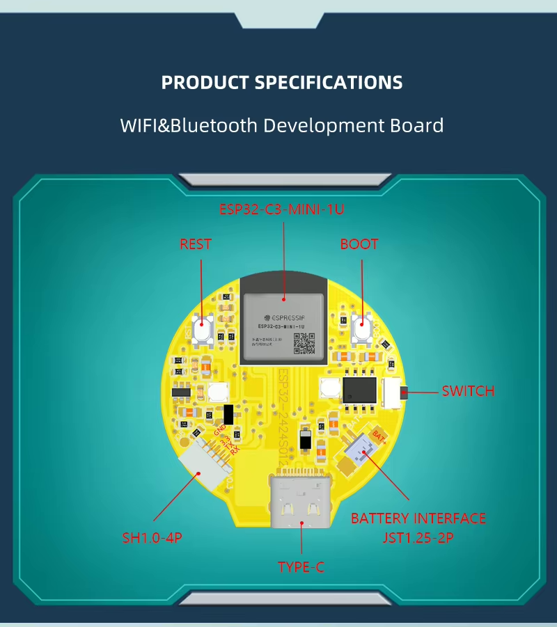
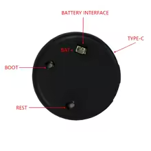

# esp32-2424S012
ESP32-2424S012C Playground

The ESP32-2424S012 is an ESP32 development board featuring a 1.28-inch IPS TFT round screen with capacitive touch, built-in Wi-Fi, Bluetooth, and sufficient processing power to support various tasks. This repository provides documentation, examples, and resources for programming the ESP32-2424S012 using the Arduino IDE or PlatformIO (VSCode).

* [Product link](https://www.aliexpress.com/item/1005005453515690.html)

* 
* 

