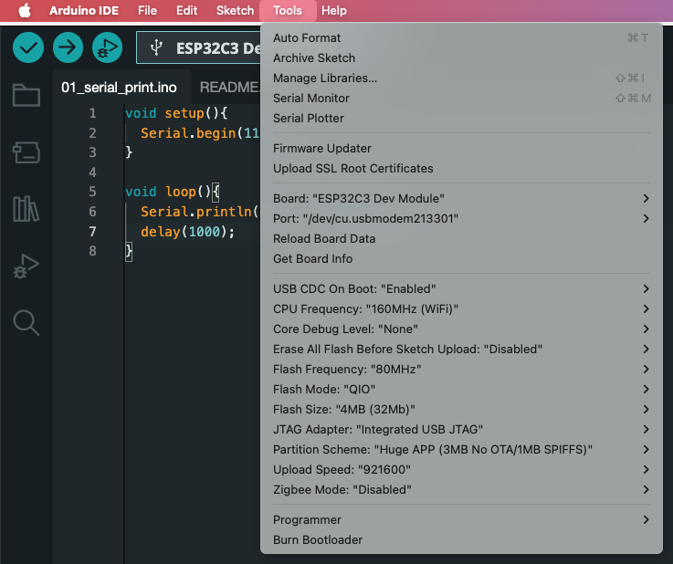
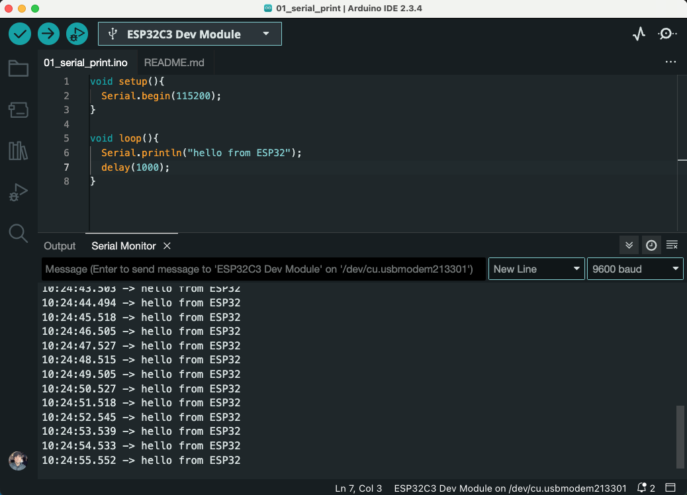

# Basic example #1

1. Check the Getting started documentation in docs dirs

2. Installing the `Additional board manager URLs`

3. Double check that the tools configurations are set like this:
- Board: "ESP32C3 Dev Module"
- Upload Speed: "921600"
- USB CDC On Boot: "Enabled"
- CPU Frequency: "160MHz (WiFi)"
- Flash Frequency: "80MHz"
- Flash Mode: "QIO"
- Flash Size: "4MB (32Mb)*
- Partition Scheme: "Huge APP (3MB No OTA/1MB SPIFFS)*
- Core Debug Level: "None"
- Erase All Flash Before Sketch Upload: "Disabled"
- JTAG Adapter: "Integrated USB JTAG"
* 

4. After compile and uploading the code:
* 

- Sometimes the device was not connected correctly, to check that I usually if there's a device present like `/dev/cu.usbmodem***`
